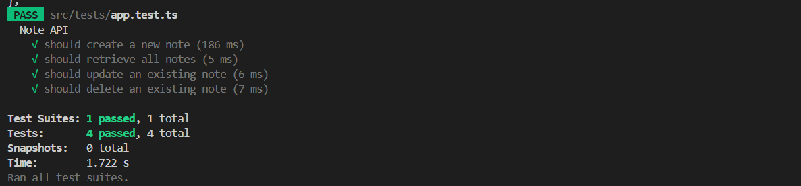

# Note-Taking App Backend Documentation

## Overview
Overview of the backend implementation of the Note-Taking App.

## Technology Stack
- **Node.js**: Runtime environment for the application.
- **Express**: Web application framework for creating API endpoints.
- **PostgreSQL**: Database to store and manage notes.
- **Jest**: Testing framework used for writing unit and integration tests.
- **Supertest**: Library for testing HTTP assertions.
- **Dotenv**: Module for loading environment variables from a `.env` file.

## Database Schema
The database schema consists of a single table to store notes. All the scripts for it are in the Database.sql file.

## API Endpoints
The API supports the following CRUD operations:

### Create a Note
- **Endpoint**: `POST /notes`
- **Description**: Adds a new note to the database.
- **Request Body**:
    ```json
    {
    "title": "Sample Title",
    "content": "Sample content"
    }
- **Response**:
    ```json
    {
    "id": 1,
    "title": "Sample Title",
    "content": "Sample content",
    "created_at": "timestamp",
    "updated_at": "timestamp"
    }

### Create a Note
- **Endpoint**: `GET /notes`
- **Description**: Retrieves all notes from the database.
- **Response**:
    ```json
    [
    {
        "id": 1,
        "title": "Sample Title",
        "content": "Sample content",
        "created_at": "timestamp",
        "updated_at": "timestamp"
    }
    ]


### Create a Note
- **Endpoint**: `PUT /notes/:id`
- **Description**: Updates an existing note based on its ID.
- **Request Body**:
    ```json
    {
    "title": "Updated Title",
    "content": "Updated content"
    }

- **Response**:
    ```json
    {
    "id": 1,
    "title": "Updated Title",
    "content": "Updated content",
    "created_at": "timestamp",
    "updated_at": "timestamp"
    }


### Create a Note
- **Endpoint**: `DELETE /notes/:id`
- **Description**: Deletes a note based on its ID.
- **Response**:
    ```json
    {
        "message": "Note deleted"
    }


### Database Integration

- **Database:** PostgreSQL
- **Integration:** Used pg module for database operations.
- **Tables:**
  - **Notes:** Stores note entries with fields for id, title, content, created_at, and updated_at.

### Testing

- **Framework:** Jest
- **HTTP Testing:** Supertest
- **Test Cases:** Covered all CRUD operations and error handling scenarios.
- **Run Tests:** 
  
```bash
npm run test
```
### Environment Variables

- `DB_USER`: Database username
- `DB_PASSWORD`: Database password
- `DB_HOST`: Database host
- `DB_DATABASE`: Database name
- `DB_PORT`: Database port
- `PORT`: Port on which the server runs

### Challenges and Solutions

- **Challenge:** Ensuring the API supports concurrent requests effectively.
- **Solution:** Utilized async/await syntax and PostgreSQL's robust handling of concurrent transactions.


### Jest Testing

- **Test Cases:** Wrote test cases for all CRUD operations and error handling scenarios.



### Application Demo Video

Here is a video demonstration of the frontend working with the backend, showcasing all the functionalities:

