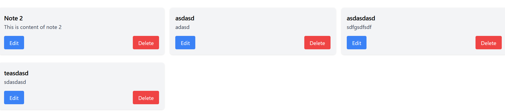
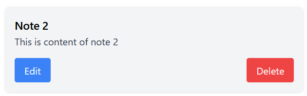

# Frontend Documentation for Note-Taking App

## Overview
Overview of frontend implementation of the Note-Taking App built using React and Tailwind CSS.

## Technology Stack
- **React**: Utilized for building the user interface with component-based architecture.
- **Tailwind CSS**: Applied for styling the application, leveraging its utility-first classes for responsive and custom designs.
- **Vite**: Employed as the build tool for fast development and efficient bundling.

## Component Structure and Descriptions

### App Component
The root component that renders the `NoteList` and provides a container for the entire application.


### NoteList Component
Manages the display of all notes and integrates `NoteForm` for adding new notes and `NoteItem` for individual note actions.


### NoteForm Component
Used for both adding new notes and updating existing ones. It dynamically adjusts its form controls based on the operation.


### NoteItem Component
Displays a single note with options to edit or delete. Each note item has buttons for these actions, styled distinctively with Tailwind CSS.


## Tailwind CSS Integration
Tailwind CSS was integrated into the project to enhance the application's styling. The utility-first classes provided by Tailwind enabled rapid and responsive design implementation. Examples of Tailwind usage include:

- **Flexbox Utilities**: Used to layout the component structure, especially in the `NoteList` and `NoteItem` components for aligning and spacing elements.
- **Padding and Margin Utilities**: Applied to create consistent spacing between UI elements.
- **Color and Typography Utilities**: Employed to ensure the text and background colors maintain good contrast and readability.

## Application Demo
Below is a video demonstration of the frontend working in conjunction with the backend, showcasing the full capabilities of the note-taking application.


## Challenges and Solutions
- **Challenge**: Ensuring responsive and consistent UI across different devices.
- **Solution**: Leveraged Tailwind CSS's responsive design utilities to create a flexible UI that adapts to various screen sizes.

## Testing the Frontend

### Overview
Frontend testing ensures that the UI renders correctly and interacts as expected with user inputs and API calls. Our tests cover individual component functionalities and their integration within the application.

### Technologies Used
- **Jest**: For running the test suites.
- **React Testing Library**: For rendering components in a test environment and interacting with them as users would.

### Key Tests
- **Component Rendering**: Verify that all components render without errors.
- **User Interaction**: Simulate user actions like clicking and typing to ensure components respond appropriately.
- **API Integration**: Mock API calls to ensure components correctly handle data fetching and updating.

### Running the Tests
To execute the frontend tests, navigate to your project directory in the terminal and use the following command:

```bash
npm run test
