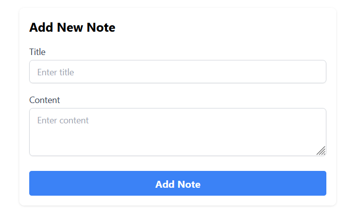

# Frontend Documentation for Note-Taking App

## Overview
Overview of frontend implementation of the Note-Taking App built using React and Tailwind CSS.

## Technology Stack
- **React**: Utilized for building the user interface with component-based architecture.
- **Tailwind CSS**: Applied for styling the application, leveraging its utility-first classes for responsive and custom designs.
- **Vite**: Employed as the build tool for fast development and efficient bundling.

## Component Structure and Descriptions

### App Component
The root component that renders the `NoteList` and provides a container for the entire application.

### NoteList Component
Manages the display of all notes and integrates `NoteForm` for adding new notes and `NoteItem` for individual note actions.

### NoteForm Component
Used for both adding new notes and updating existing ones. It dynamically adjusts its form controls based on the operation.

### NoteItem Component
Displays a single note with options to edit or delete. Each note item has buttons for these actions, styled distinctively with Tailwind CSS.

## Tailwind CSS Integration
Tailwind CSS was integrated into the project to enhance the application's styling. The utility-first classes provided by Tailwind enabled rapid and responsive design implementation. Examples of Tailwind usage include:

- **Flexbox Utilities**: Used to layout the component structure, especially in the `NoteList` and `NoteItem` components for aligning and spacing elements.
- **Padding and Margin Utilities**: Applied to create consistent spacing between UI elements.
- **Color and Typography Utilities**: Employed to ensure the text and background colors maintain good contrast and readability.

## Application Demo
Below is a video demonstration of the frontend working in conjunction with the backend, showcasing the full capabilities of the note-taking application.

## Challenges and Solutions
- **Challenge**: Ensuring responsive and consistent UI across different devices.
- **Solution**: Leveraged Tailwind CSS's responsive design utilities to create a flexible UI that adapts to various screen sizes.

- **Challenge**: TypeScript integration with React components.
- **Solution**: Utilized TypeScript for type-checking and prop validation, ensuring robust code and preventing runtime errors.
